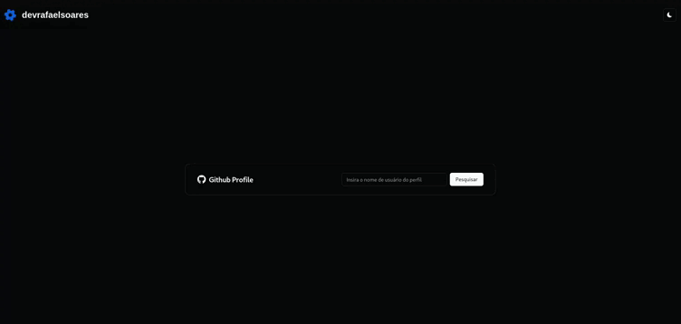

# 👤 Github Profile App

[![Contributors][contributors-shield]][contributors-url] [![Forks][forks-shield]][forks-url] [![Stargazers][stars-shield]][stars-url] [![Issues][issues-shield]][issues-url] [![MIT License][license-shield]][license-url]

### 📑 Tópicos:

-   [Sobre](#sobre)
-   [Instalação](#-instalação)
-   [Como usar?](#como-usar-)
-   [Contatos](#-contatos)

## ℹ️ Sobre

### Aplicação Web que permiti a busca das informações de um usuário existente no Github

#### 📊 Informações exibidas:

-   👤 `Nome de usuário`
-   👥 `Quantidade seguidores`
-   📚️ `Quantidade de reposiórios`
-   🚀 `Principais repositórios (Em ordem de estrelas e forks)`

## ⬇️ Instalação

#### ⚠️ Será necessário ter instalado em seu sistema operacional o Docker

#### Dentro da pasta do projeto execute os seguintes comandos:

#### 📌 Criando a imagem do projeto:

```docker
docker build . -t github-profiles-app
```

#### 📌 Criando e executando o contâiner da imagem expondo na porta 5173

```docker
docker container run -d -p 5173:5173 github-profiles-app
```

#### ⚠️ Verifique antes se existe algum processo esteje rodando em background na porta especificada para uso do contâiner, caso tenha encerre este processo

## ❓Como usar ?

### 📍 Acesse http://localhost:5173

### 🖥️ Utilização da aplicação em ambiente desktop

<div align="center">
    
</div>

### 📱 Utilização da aplicação em ambiente mobile

<div align="center">
    
</div>

## 📌 Contatos

[![LinkedIn][linkedin-shield]][linkedin-url] [![Gmail][gmail-shield]][gmail-url] [![Meu Portfolio][me-portfolio-shield]][me-portfolio-url]

[example-use-mobile]: docs/example-use-mobile.gif
[example-use-desktop]: docs/example-use-desktop.gif
[contributors-shield]: https://img.shields.io/github/contributors/devrafaelsoares/github-profiles-app.svg?style=for-the-badge
[contributors-url]: https://github.com/devrafaelsoares/github-profiles-app/graphs/contributors
[forks-shield]: https://img.shields.io/github/forks/devrafaelsoares/github-profiles-app.svg?style=for-the-badge
[forks-url]: https://github.com/devrafaelsoares/github-profiles-app/network/members
[stars-shield]: https://img.shields.io/github/stars/github-profiles-app/react-countdown.svg?style=for-the-badge
[stars-url]: https://github.com/devrafaelsoares/github-profiles-app/stargazers
[issues-shield]: https://img.shields.io/github/issues/devrafaelsoares/github-profiles-app.svg?style=for-the-badge
[issues-url]: https://github.com/devrafaelsoares/github-profiles-app/issues
[license-shield]: https://img.shields.io/github/license/devrafaelsoares/github-profiles-app.svg?style=for-the-badge
[license-url]: https://github.com/devrafaelsoares/github-profiles-app/blob/master/LICENSE
[license-url]: https://github.com/devrafaelsoares/store-api-restful/blob/master/LICENSE
[linkedin-shield]: https://img.shields.io/badge/LinkedIn-0077B5?style=for-the-badge&logo=linkedin&logoColor=white
[linkedin-url]: https://www.linkedin.com/in/rafael-henrique-soares-de-freitas-2a667a23a/
[gmail-shield]: https://img.shields.io/badge/Gmail-D14836?style=for-the-badge&logo=gmail&logoColor=white
[gmail-url]: mailto:rafael.soares.developer@gmail.com
[me-portfolio-shield]: https://img.shields.io/badge/website-000000?style=for-the-badge&logo=About.me&logoColor=white
[me-portfolio-url]: https://devrafaelsoares.vercel.app
